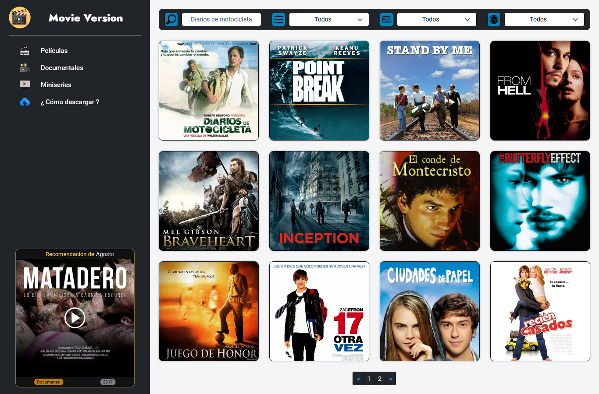

# **Movie-Version**

Movie Version es un sistema de recomendación de películas, documentales y series que están especialmente seleccionados para compartir con la comunidad del buen cine.

La idea surge en poder brindar a las personas un momento de placer y en algunos casos de sentimientos encontrados.

## **Partes del sistema**

Movie Version está separado en 5 páginas.

- **Home** : Encontramos una presentación al sistema y el punto de contacto para recomendarme nuevos films.
- **Películas** / **Documentales** / **Miniseries** : Presentan información de los films y el enlace de descarga de cada uno.
- **¿Cómo descargar?** : En esta sección se encuentra explicado con detalles los pasos para descargar cualquier film.



## **Instructivo para deployar un proyecto en github pages**

Recuerden : Github Pages solo despliega páginas estáticas.

- 1° Instalar gh-pages:

```js
npm install gh-pages --save-dev
```

- 2° En el archivo package.json agregar las siguientes líneas:

  Con "homepage" indicamos dónde se va a desplegar el sitio.
  Con predeploy compilamos la aplicación.
  Con deploy lo desplegamos en github.

```js
"homepage": "https://{UsernameGithub}.github.io/{NameRepo}",
"predeploy": "npm run build",
"deploy": "gh-pages -d build"
```

- 3° Como subir al branch gh-pages nuestra app

```js
npm run deploy
```

## **Demo**

[https://jav1erram0s.github.io/Movie-Version/](https://jav1erram0s.github.io/Movie-Version/ "Movie-Version")
